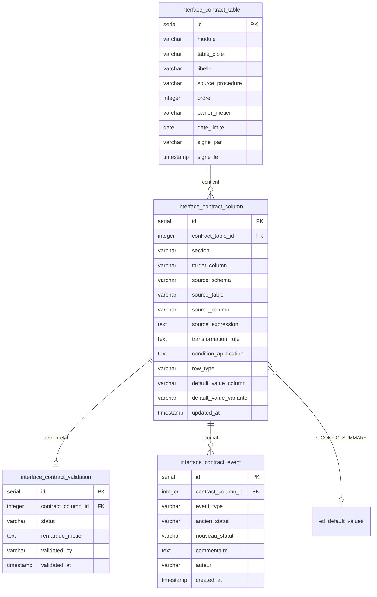

# Proposition — Module "Contrats d'interface" dans Migration Factory (v2)

Objectif : remplacer le classeur `contrat_interface_migration_SAP_IFS_v3.xlsx` (figé, envoyé par mail) par un module natif de l'application, avec une base qui porte le contrat technique **et** l'état de validation métier, une visionneuse pour que le métier consulte et valide en ligne, et un écran de gestion pour la partie technique. L'export Excel reste possible, mais devient une génération à la demande depuis la base plutôt que la source de vérité.

Cette v2 reprend la première proposition en la relisant de façon critique. Les changements par rapport à la v1 sont listés en §9.

## 1. Pourquoi une base plutôt qu'un fichier

Le classeur a un défaut structurel : dès qu'on corrige un script SQL ou qu'on ajoute une colonne, il faut regénérer le fichier et perdre la trace de ce qui a déjà été validé, ou fusionner à la main. En base, on sépare deux choses qui n'évoluent pas au même rythme :

- la **définition du contrat** (colonne cible, source, règle) : bouge quand le code ETL bouge ;
- l'**état de validation métier** (validé / à corriger, remarque, qui, quand) : bouge quand le métier relit, et ne doit jamais être écrasé par une évolution technique.

Ce qu'apporte en plus l'application par rapport à un fichier, et qui justifie vraiment le module : voir des **données réelles** à côté de la règle (un échantillon de la colonne SAP source et de la colonne cible), détecter automatiquement qu'une validation est **devenue obsolète** parce que la règle a changé depuis, et repérer les colonnes de la table cible **qui ne sont documentées nulle part**.

## 2. Modèle de données

Quatre tables dans `public` (conventions de `etl_default_values` : `SERIAL`, `created_at`/`updated_at`, `UNIQUE` sur clé naturelle, trigger `update_updated_at_column()` déjà présent depuis la migration 004) et deux vues.

**`interface_contract_table`** — un onglet du classeur = une ligne. `module` ('supplier' aujourd'hui, générique pour customer/inventory/projet demain), `table_cible`, `source_procedure` (traçabilité vers le script SQL réel), `ordre`. S'y ajoutent trois choses de pilotage : `owner_metier` et `date_limite` (qui doit relire, pour quand), et une **signature globale** `signe_par`/`signe_le`, distincte du pourcentage calculé ligne à ligne — c'est l'équivalent du "bon pour accord" en bas de page, que le % ne remplace pas.

**`interface_contract_column`** — une ligne du classeur = une ligne. Reprend les colonnes du contrat actuel (`section`, `target_column`, `source_expression`, `transformation_rule`, `condition_application`, `row_type` = `COLUMN` / `CONFIG_SUMMARY` / `NOTE`). Deux ajouts :

- une **source structurée** `source_schema` / `source_table` / `source_column` (nullable, à côté du texte libre) : c'est ce qui permet l'aperçu de données réelles (§5) et l'analyse d'impact ("quelles lignes de contrat dépendent de `lfa1.stceg` ?"). Pour les lignes calculées ou multi-sources, on renseigne la source principale et le reste dans `source_expression`.
- `default_value_variante` en plus de `default_value_column` : la clé réelle de `etl_default_values` est (`table_cible`, `colonne`, `variante`). Sans la variante, la jointure de la vue pouvait renvoyer plusieurs lignes pour une même colonne (cas `CUSTOMER` / `CUSTOMERFILE` sur les mêmes tables) — défaut de la v1, corrigé.

`UNIQUE(contract_table_id, target_column)` reste la clé naturelle stable qui permet de regénérer ou de réimporter sans perdre la validation.

**`interface_contract_validation`** — le **dernier** état, 1-1 avec la colonne, séparé exprès (cf. §1). `statut` : `A_VALIDER` / `VALIDE` / `A_CORRIGER` / `NON_APPLICABLE`. `validated_by` posé depuis le JWT côté serveur.

**`interface_contract_event`** — journal de tout ce qui se passe sur une ligne : changement de statut (`STATUT`, avec ancien/nouveau), commentaire libre (`COMMENTAIRE`), modification de la définition par la tech (`DEFINITION`), reprise depuis un Excel (`IMPORT_EXCEL`). Une seule table couvre à la fois l'audit (qui a changé quoi, quand) et le **fil de discussion** tech ↔ métier — la v1 n'avait qu'un champ remarque écrasé à chaque saisie, ce qui perdait les allers-retours.

**`v_interface_contract`** (vue de détail) — jointure des tables + `etl_default_values`, avec un calcul d'**obsolescence** : `validation_obsolete = (statut = 'VALIDE' AND column.updated_at > validated_at)`. Autrement dit, si la tech modifie la règle d'une colonne déjà validée, la visionneuse la signale automatiquement "validée mais règle modifiée depuis" sans que personne n'ait à y penser. C'est ce qui rend la séparation définition/validation réellement sûre.

**`v_interface_contract_summary`** (vue par table) — nombre de lignes, validées, à corriger, à valider, obsolètes, `pct_valide` : alimente le tableau de bord et le panneau de gauche de la visionneuse.

Migration prête : `migrations/051_create_interface_contracts.sql`.

## 3. Qui est source de vérité de la définition ?

Point que la v1 laissait flou. Proposition claire :

1. **Chargement initial** par `scripts/seed_interface_contracts.py`, qui réutilise directement les blocs `section`/`row`/`note`/`config` déjà écrits dans `build_contrat_interface_v2.py` (aucune relecture des 16 scripts SQL), en `INSERT ... ON CONFLICT DO UPDATE` sur la clé naturelle.
2. **Ensuite, la base est la source de vérité** : la tech corrige/ajoute des lignes dans l'écran de gestion (§5), chaque modification bumpant `updated_at` (trigger) et écrivant un événement `DEFINITION`. Le script de seed ne sert plus qu'à amorcer un nouveau module.

On évite ainsi le double référentiel Python/base.

## 4. API backend

Blueprint `backend/api/interface_contracts.py`, même schéma que `default_values.py` (JWT, pagination, filtres), enregistré dans `backend/api/__init__.py` sous `{API_PREFIX}/interface-contracts`.

| Méthode | Route | Usage | Rôle |
|---|---|---|---|
| GET | `/tables` | Liste des tables + compteurs (`v_interface_contract_summary`) | tous |
| GET | `/tables/<id>/columns` | Détail (`v_interface_contract`), filtres statut / section / obsolète / recherche | tous |
| GET | `/tables/<id>/coverage` | **Écart de couverture** : colonnes réelles de la table cible (`information_schema.columns`, comme `data_browser.py`) absentes du contrat, et lignes du contrat sans colonne réelle | tous |
| GET | `/columns/<id>/sample` | **Aperçu de données réelles** : N valeurs distinctes de `source_table.source_column` et de la colonne cible (identifiants validés contre `information_schema`, même garde-fou anti-injection que `data_browser.py`) | tous |
| GET | `/columns/<id>/events` | Fil de discussion + historique des statuts | tous |
| PUT | `/columns/<id>/validation` | Change le statut + remarque ; écrit l'événement `STATUT` ; `validated_by`/`validated_at` posés depuis `get_jwt_identity()` | operator, admin |
| POST | `/columns/<id>/comments` | Ajoute un commentaire (événement `COMMENTAIRE`) | operator, admin |
| PUT | `/tables/<id>/sign` | Signature globale de la table (`signe_par`/`signe_le`) | operator, admin |
| POST/PUT/DELETE | `/tables`, `/tables/<id>`, `/columns`, `/columns/<id>` | **CRUD de la définition** (manquait en v1) ; écrit un événement `DEFINITION` | admin |
| GET | `/export` | Regénère le classeur Excel (helpers openpyxl existants, alimentés depuis les vues) | tous |
| POST | `/import` | **Réimport d'un classeur rempli hors ligne** : lit les colonnes "Validé O/N / Remarque" et met à jour la validation par clé (`table_cible`, `target_column`), événement `IMPORT_EXCEL` | admin |

Rôles : le modèle `User` n'a que `admin` / `operator` avec des listes de permissions codées dans `has_permission()`. Il suffit d'ajouter `validate_contracts` aux deux rôles et `manage_contracts` à `admin`, et de protéger les routes avec `require_role` (`backend/utils/auth_decorators.py`) — pas de nouveau rôle à créer. Un interlocuteur métier qui reçoit un compte `operator` peut donc valider sans voir/faire autre chose de dangereux (les operators n'ont ni `configure_system` ni `manage_mappings`).

## 5. Écrans frontend

Un seul module `frontend/src/pages/InterfaceContracts/`, avec un composant `ContractTable` réutilisé en lecture (`readOnly`) et en édition — plutôt que deux pages qui dupliquent le même tableau (v1).

**Tableau de bord** (en-tête de la page) : une carte par table depuis `v_interface_contract_summary` — % validé, nb à corriger, nb obsolètes, responsable, échéance, signée ou non. Filtre par module.

**Visionneuse** (calquée sur `DataBrowser/DataBrowserPage.tsx`) : panneau de gauche = tables groupées par module avec pastille verte/orange/rouge ; panneau de droite = colonnes de la table groupées par `section` (bandeaux comme dans le classeur), recherche, filtres statut / obsolète / type de ligne. Chaque ligne a un bouton "Voir les données" qui ouvre l'aperçu réel (`/sample`) source ↔ cible — c'est le geste qui manque le plus au fichier Excel aujourd'hui : le métier lit "`lfa1.name1` tronqué à 100" et voit tout de suite quels fournisseurs sont concernés. Un bandeau "Couverture" affiche les colonnes non documentées (`/coverage`).

**Validation** (même tableau, `readOnly=false`, réservé aux rôles autorisés) : boutons Valider / À corriger / N/A, champ remarque, fil de discussion dépliable par ligne, et le bouton "Signer la table" en haut. Une ligne obsolète est repassée visuellement en "à revalider" même si son statut est `VALIDE`.

**Deep link** : route `interface-contracts/:tableCible` pour envoyer par mail un lien direct vers une table à relire.

Navigation : entrée de premier niveau dans `menuItems` de `Layout.tsx` (à côté de "Data Browser"), pas une carte sous Configuration, puisque la cible est aussi le métier. Route `App.tsx` : `<Route path="interface-contracts/:tableCible?" element={<InterfaceContractsPage />} />`.

## 6. Export / import Excel — le mode hybride

L'export (`/export`) produit un classeur au même format que le v3, depuis l'état réel de la base à l'instant T (contrat + validations + fil de discussion résumé en dernière remarque). L'**import** (`/import`) fait le chemin inverse : quelqu'un sans compte remplit les colonnes jaunes, renvoie le fichier, la tech l'importe, et les statuts/remarques sont repris ligne à ligne avec un événement `IMPORT_EXCEL` portant le nom du relecteur. Ça règle le point ouvert de la v1 sur les comptes : les deux modes coexistent, l'application reste la source de vérité.

## 7. Points restant à trancher

- **Aperçu de données réelles** : quelles tables sont sensibles ? L'échantillon expose des valeurs SAP (noms, IBAN dans `identity_pay_info`…). Proposition : limiter à 20 valeurs distinctes, masquer par défaut les colonnes listées dans une petite liste noire (IBAN, numéros fiscaux), déblocage `admin`.
- **Périmètre initial** : seed du seul module `supplier` (16 tables), les autres modules quand leurs contrats seront rédigés.
- **Signature globale** : bloque-t-elle les modifications de définition (table "gelée" jusqu'à dé-signature) ou reste-t-elle purement informative ? Proposition : informative, avec un événement `DEFINITION` qui remet `signe_le` à NULL si la définition change après signature (même logique que l'obsolescence ligne à ligne).

## 8. Étapes de mise en œuvre

1. Appliquer `migrations/051_create_interface_contracts.sql`.
2. `scripts/seed_interface_contracts.py` à partir de `build_contrat_interface_v2.py` (+ renseigner `source_table`/`source_column` là où la source est une colonne SAP simple).
3. `backend/models/interface_contract.py` (4 classes SQLAlchemy, schéma `public`, calquées sur `EtlDefaultValue`) ; permissions `validate_contracts` / `manage_contracts` dans `User.has_permission()`.
4. `backend/api/interface_contracts.py` (lecture, validation, événements, CRUD, coverage, sample) + enregistrement du blueprint.
5. `frontend/src/pages/InterfaceContracts/` (tableau de bord, `ContractTable`, aperçu de données, fil de discussion) + route `App.tsx` + entrée `Layout.tsx`.
6. Export puis import Excel.

Les étapes 1-5 sans coverage/sample donnent déjà un module utilisable ; coverage, sample, import Excel et signature peuvent suivre en second lot.

## 9. Ce qui change par rapport à la v1

- Correction d'un défaut : la jointure vers `etl_default_values` ignorait `variante` (risque de doublons dans la vue).
- Détection automatique des validations obsolètes (`updated_at` fiabilisé par trigger + calcul dans la vue) — sans ça, la séparation définition/validation était une promesse non tenue.
- Journal `interface_contract_event` (audit + discussion) à la place d'un champ remarque écrasé ; l'historique n'est plus "optionnel".
- Source structurée → aperçu de données réelles et analyse d'impact ; écart de couverture contre `information_schema`.
- Signature globale par table, responsable métier, échéance, vue de synthèse pour un tableau de bord.
- CRUD de la définition côté tech (absent de la v1) et clarification : la base est la source de vérité après le seed.
- Rôles : réutilisation de `admin`/`operator` + `require_role`, sans nouveau rôle.
- Import Excel en retour, pour les relecteurs sans compte.
- Un seul composant tableau en lecture/édition, deep link par table.
